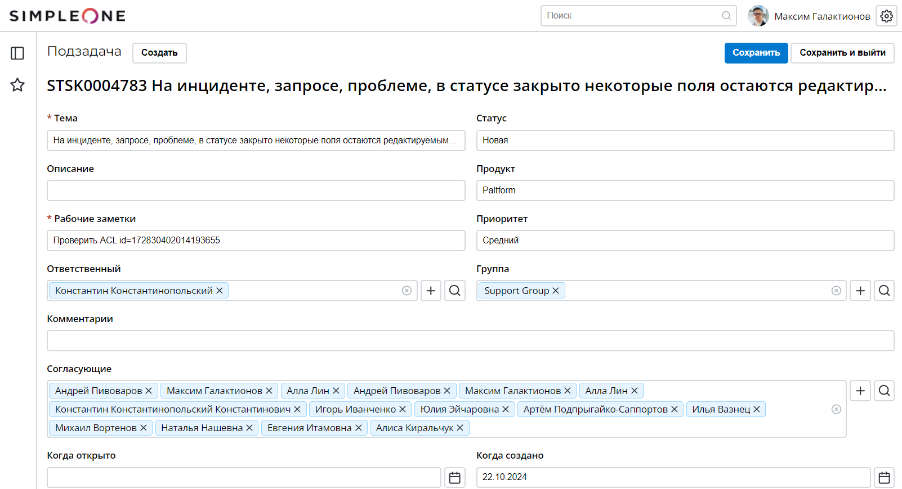

# Тестовое задание по верстке компания  ITGLOBAL.COM

[](#)
[](#)

[](#)

[](#)

## Описание
Так как при выборе стека мне была предоставлена полная свобода, я остановилась на привычном и востребованном React18, CSS Modules, JS.
В проекте использовала компонентный подход т.к. он имеет массу преимуществ:
1. Модульность: Каждый компонент изолирован, что облегчает его повторное использование и тестирование
2. Читаемость: Легче понять структуру приложения, когда все файлы, относящиеся к компоненту, находятся в одной папке.
3. Удобство поддержки: Изменения в компоненте можно сделать в одном месте, не беспокоясь о том, как это повлияет на другие части приложения.
   
## Live просмотр



👉 [Перейти на страницу демо](https://dalilam25.github.io/test-verstka/)


Либо запустить локально:
```
git clone https://github.com/DalilaM25/test-verstka.git
cd test-verstka
npm i
npm run build
npm run start
```
Приложение запустится в браузере.

## Что можно доработать...
Пока сделана верстка компонентов, адаптив под десктоп и мобилку. Добавлено немного логики, чтобы можно было продемонстрировать интерактивность компонентов, но только в рамках требований по макету. Далее можно приступать к работе с сервером, добавлять функционал компонентам и корректировать требования к отображению и интерактивности элементов в соответствии с пожеланиями заказчика/постановкой задачи. 
